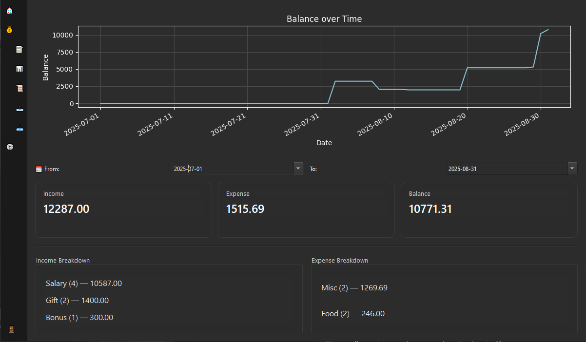

# Azralithia Finance Tracker (GUI)

A modern PyQt6-based finance tracker with a sleek sidebar, animated
menus, and full light/dark mode support.

------------------------------------------------------------------------

## ✨ Features

- 🖥️ Animated Sidebar Navigation

    -   Expandable/collapsible sidebar with smooth transitions and emoji icons.


- 🎨 Light & Dark Themes

    -   Toggle switch with animated thumb and emojis 🌙☀️.


- 📅 Customizable Date Formats

    -   Choose your preferred date display format (e.g., DD-MM-YYYY, MM-DD-YYYY).


- ⚡ Professional Logging

    -   Console + rotating log files (keeps last 5).


- 📑 Comprehensive Transaction Management

    -   Add, edit, and delete transactions with category management.

    -   Recent transactions preview with quick edit/delete buttons.

    -   Transaction Log with advanced filtering by type, category, date range, and notes.

    -   Inline editing and deletion with optional confirmation dialogs.

    -   Undo option for deletions (5-second window) across manage transactions and transaction log.


- 📊 Dynamic Financial Summary

    -   Main tab shows last 7 days and current month summaries.

    -   Income, expense, and balance breakdowns by category.

    -   Interactive balance-over-time graph (requires matplotlib).

- 🗂️ Import & Export Enhancements

    -   Export transactions to CSV, JSON, or XLSX.

    -   Filtered export support based on current filters.

    -   Import transactions with full database override or merge, handling duplicates optionally.

- 🪄 Polished UX

    -   Hover/pressed states, fade-in effects, submenu animations, responsive layouts.

    -   Quick notifications like "Transaction Saved" auto-disappear after 5 seconds.

    -   Updated button colors for better visual hierarchy.

------------------------------------------------------------------------
## 🖼️ Screenshots

  
*Main dashboard showing last 7 days and current month summary.*

  
*Manage transactions with quick edit/delete options.*

  
*Balance-over-time graph (requires matplotlib).*

  
*Export menu with options for exporting to: CSV, Excel and JSON documents*


------------------------------------------------------------------------
## 🚀 Installation

``` bash
git clone https://github.com/Azralithia/azralithia-finance-tracker-gui.git
cd azralithia-finance-tracker-gui
pip install -r requirements.txt
python finance_tracker_gui.py
```

------------------------------------------------------------------------

## 🛠️ Requirements

-   Python 3.10+
-   [PyQt6](https://pypi.org/project/PyQt6/)
-   [matplotlib](https://pypi.org/project/matplotlib/) (optional, for balance-over-time graph)
-   [openpyxl](https://pypi.org/project/openpyxl/) (optional, for Excel export)

------------------------------------------------------------------------

## ⚙️ Configuration & Settings

-   Save filters on exit for persistent transaction log views.

-   Toggle delete confirmation dialogs to prevent accidental data loss.

-   Manage income and expense categories dynamically.

-   Choose preferred date format for display.

-   Enable/disable undo option for transaction deletion.

------------------------------------------------------------------------

## 📜 License

This project is licensed under the [MIT License](LICENSE.md).

------------------------------------------------------------------------

## 🔗 Related Projects
- [Azralithia Finance Tracker (CLI)](https://github.com/Azralithia/azralithia-finance-tracker-cli)  
  Command-line version with SQLite integration and CSV export.

------------------------------------------------------------------------
## 🏷️ Credits

Built as part of the **Azralithia** suite of projects.
